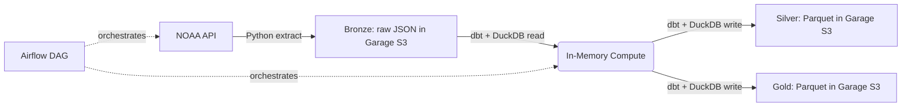

## Weather Data Pipeline (Data Lakehouse Architecture)
An end-to-end batch pipeline that ingests daily weather observations from the NOAA API, lands them in an object storage layer, and models them through a Medallion Architecture (Bronze → Silver → Gold) using dbt and DuckDB.

By replacing a traditional always-on relational database with ephemeral, in-memory compute (DuckDB) and open-format Parquet files (Garage S3), this project demonstrates a highly scalable, fully decoupled Data Lakehouse. It includes support for idempotent historical backfills, comprehensive data quality tests, and continuous integration on every PR.
Swap the source: This repo is structured so the ingestion layer is decoupled from modeling. Point ingestion/extract.py at a different API (transit, market data, etc.) and the dbt layer, orchestration, and tests carry over unchanged.

## Architecture
Storage and compute are completely separated. Raw JSON payloads land in the S3 bucket. During a dbt run, DuckDB spins up dynamically via Airflow, reads the JSON files directly over the network, executes transformations in memory, materializes the final star schema as highly compressed Parquet files back into the data lake, and spins down.

## Tech Stack
#	Orchestration: Apache Airflow (Dockerized)
#	Storage (Data Lake): Garage (S3-compatible distributed object storage)
#	Compute Engine: DuckDB (Ephemeral, in-memory analytical engine)
#	Transformation: dbt (dbt-duckdb adapter)
#	Ingestion: Python (boto3, requests)

## Key Features
⚬	Zero-Database Footprint: Data is queried and transformed directly from S3 using DuckDB's httpfs extension without ever loading it into a persistent database engine.
⚬	Idempotent Backfills: The pipeline is designed to safely process historical time ranges concurrently (or sequentially to prevent file locks) without duplicating data.
⚬	Resilient Schema Inference: Capable of handling delayed or empty API responses by explicitly defining nested structs (e.g., handling missing NOAA results arrays) before execution.
⚬	Data Quality Testing: Standard dbt tests validate staging columns, verify dimension table integrity, and catch anomalies in upstream source data.

## Local Setup & Execution

1. Initialize the Data Lake (Garage)
Assign a storage layout and create the access keys for your local node:
docker compose exec garage /garage layout assign -z dc1 -c 1G <YOUR_NODE_ID>
docker compose exec garage /garage layout apply --version 1
docker compose exec garage /garage bucket create weather-lake
docker compose exec garage /garage key create lake-key
docker compose exec garage /garage bucket allow weather-lake --read --write --owner --key lake-key

2. Configure Environment
Update your .env file with the newly generated Garage credentials:
STORAGE_ENDPOINT=http://garage:3900
STORAGE_ACCESS_KEY=your_new_access_key_id
STORAGE_SECRET_KEY=your_new_secret_access_key

3. Run Historical Backfill
docker compose exec airflow-scheduler airflow dags backfill weather_lakehouse_pipeline \
  --start-date 2024-01-01 --end-date 2024-01-07

## owner
Betelhem Dejene Desta
Data Engineer/ Platform Engineer
betadeju@gmail.com