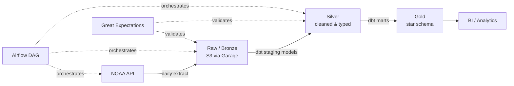

# Modern Data Stack
# Weather Data Pipeline (Two-Tier (Data Lake + Data Warehouse) architecture)

An end-to-end batch pipeline that ingests daily weather observations from the NOAA API, lands them in a raw storage layer, models them through a bronze → silver → gold architecture with dbt, and surfaces analytics-ready tables in a warehouse — with idempotent backfills, data quality tests, and CI on every PR.

> Swap the source: this repo is structured so the ingestion layer is decoupled from modeling. Point `ingestion/extract.py` at a different API (transit, market data, etc.) and the dbt layer, orchestration, and tests carry over unchanged.

## Architecture

## Why these tools

| Choice | Reasoning |
|---|---|
| **dbt** over raw SQL scripts | Version-controlled, testable transformations with automatic lineage tracking and dependency management via `dbt deps`. |
| **Airflow** over cron | Retry logic, exponential backoff, and idempotent backfill support that a cron job can't provide at this scale. |
| **Bronze/silver/gold layering** | Keeps raw data immutable and replayable — if a modeling bug ships, we re-run from bronze instead of re-extracting from the source. |
| **Postgres locally, Cloud-ready** | Cheap to develop and demo, but the dbt models are warehouse-agnostic and port to a cloud warehouse with a simple config change. |
| **Garage** over MinIO/AWS | Lightweight, distributed S3-compatible storage engine that runs locally with minimal overhead and strict API compliance. |

## Project structure
weather-pipeline/
├── README.md
├── docker-compose.yml
├── garage.toml
├── .gitignore
├── .github/workflows/ci.yml
├── ingestion/
│   ├── extract.py
│   ├── load_raw.py
│   ├── config.py
│   └── tests/
├── dbt/
│   ├── models/
│   │   ├── staging/
│   │   ├── intermediate/
│   │   └── marts/
│   ├── tests/
│   ├── packages.yml
│   └── dbt_project.yml
├── orchestration/
│   └── dags/weather_pipeline_dag.py
├── great_expectations/
│   └── expectations/
└── requirements.txt

## How to run it
1. Clone and configure environment
git clone [https://github.com/](https://github.com/)<you>/weather-pipeline.git
cd weather-pipeline
cp .env.example .env        # Add your NOAA_API_TOKEN here

2. Start and initialize Garage (Object Storage)
# Boot the storage layer
docker compose up -d garage

# Assign and apply the single-node layout
NODE_ID=$(docker compose exec garage /garage status | grep '^[a-z0-9]' | awk '{print $1}')
docker compose exec garage /garage layout assign -z dc1 -c 1G $NODE_ID
docker compose exec garage /garage layout apply --version 1

# Create the bronze bucket and generate access keys
docker compose exec garage /garage bucket create weather-raw
docker compose exec garage /garage key create weather-key
docker compose exec garage /garage bucket allow weather-raw --read --write --owner --key weather-key

3. Update credentials and start the pipeline
STORAGE_ACCESS_KEY=your_new_access_key_id
STORAGE_SECRET_KEY=your_new_secret_access_key
docker compose up -d

4. Trigger a historical backfill
Because the NOAA API operates on a delay, the pipeline must be backfilled to populate the warehouse with historical records.
docker compose exec airflow-scheduler airflow dags backfill weather_pipeline \
  --start-date 2024-01-01 --end-date 2024-01-07

## Tech stack
Python · dbt · Airflow · PostgreSQL · Garage · Great Expectations · Docker · GitHub Actions

## owner
Betelhem Dejene Desta
Data Engineer/ Platform Engineer
betadeju@gmail.com