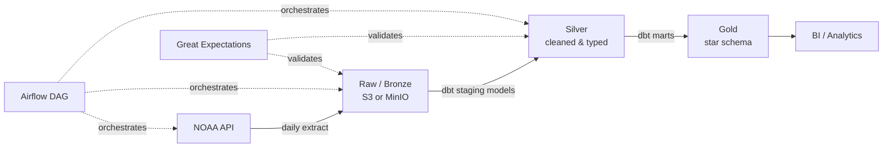

# Weather Data Pipeline

An end-to-end batch pipeline that ingests daily weather observations from the NOAA API, lands them in a raw storage layer, models them through a bronze → silver → gold architecture with dbt, and surfaces analytics-ready tables in a warehouse — with idempotent backfills, data quality tests, and CI on every PR.

> Swap the source: this repo is structured so the ingestion layer is decoupled from modeling. Point `ingestion/extract.py` at a different API (transit, market data, etc.) and the dbt layer, orchestration, and tests carry over unchanged.

## Architecture



**Flow summary:**
1. **Extract** — Python script pulls daily station observations from the NOAA API and writes raw JSON to object storage, partitioned by `ingestion_date`.
2. **Load (bronze)** — raw files are loaded as-is into the warehouse's raw schema, no transformation, full audit trail preserved.
3. **Transform (silver/gold)** — dbt models clean types, deduplicate late-arriving records, and build a star schema (`fct_observations`, `dim_station`, `dim_date`).
4. **Orchestrate** — Airflow schedules the daily run, handles retries, and supports manual backfills for any date range.
5. **Validate** — dbt tests (uniqueness, not-null, referential integrity) and Great Expectations checks run at each layer boundary.

## Why these tools

| Choice | Reasoning |
|---|---|
| **dbt** over raw SQL scripts | Version-controlled, testable transformations with automatic lineage tracking and documentation generation |
| **Airflow** over cron | Retry logic, backfill support, and observability that a cron job can't give you at this scale |
| **Bronze/silver/gold layering** | Keeps raw data immutable and replayable — if a modeling bug ships, we re-run from bronze instead of re-extracting from the source |
| **DuckDB/Postgres locally, Snowflake/BigQuery-ready** | Cheap to develop and demo, but the dbt models are warehouse-agnostic and port to a cloud warehouse with a config change |
| **Great Expectations** alongside dbt tests | dbt tests catch schema/relationship issues; GE catches statistical anomalies (e.g. a station reporting -200°F) |

## Project structure

```
weather-pipeline/
├── README.md
├── docker-compose.yml
├── .github/workflows/ci.yml
├── ingestion/
│   ├── extract.py
│   ├── config.py
│   └── tests/
├── dbt/
│   ├── models/
│   │   ├── staging/
│   │   ├── intermediate/
│   │   └── marts/
│   ├── tests/
│   └── dbt_project.yml
├── orchestration/
│   └── dags/weather_pipeline_dag.py
├── great_expectations/
│   └── expectations/
├── docs/
│   └── data_model.png
└── requirements.txt
```

## How to run it

```bash
git clone https://github.com/<you>/weather-pipeline.git
cd weather-pipeline
cp .env.example .env        # add your NOAA API token
docker-compose up
```

This spins up:
- A local Postgres/DuckDB warehouse
- Airflow webserver + scheduler (UI at `localhost:8080`)
- The dbt project, ready to run via `dbt run` inside the Airflow container or directly

To trigger a manual backfill for a specific date range:

```bash
docker-compose exec airflow airflow dags backfill weather_pipeline \
  --start-date 2024-01-01 --end-date 2024-01-31
```

## Data model

`fct_observations` (grain: one row per station per day) joins to:
- `dim_station` — station metadata, location, elevation
- `dim_date` — standard date dimension for time-based analysis

Full lineage graph is generated via `dbt docs generate` and served with `dbt docs serve`.

## Data quality & idempotency

- **Idempotent loads**: each run is scoped to `ingestion_date`, so re-running a date overwrites rather than duplicates (`MERGE`/upsert pattern in the silver layer).
- **Late-arriving data**: NOAA occasionally revises prior-day readings; the pipeline re-checks the last 3 days on each run and updates changed records rather than only appending new ones.
- **Tests on every PR**: GitHub Actions runs `dbt build` (compile + test) and Great Expectations checks against a sample dataset before merge.

## What I'd change at scale

- Swap the single-node ingestion script for a fan-out job (e.g. one task per station or region) to parallelize extraction once station count grows beyond a few hundred.
- Partition the warehouse tables by `observation_date` and cluster by `station_id` to avoid full-table scans as history accumulates.
- Move from Airflow's PostgresOperator-style loading to a bulk-load pattern (e.g. `COPY` from object storage) once raw volume exceeds what row-by-row inserts can handle.
- Introduce a schema registry / contract check on the ingestion layer so upstream API changes fail fast in CI instead of silently breaking downstream models.

## Known limitations

- Currently supports a single data source (NOAA); multi-source ingestion would need a pluggable extractor interface.
- No streaming/near-real-time path — this is a batch-only design by intent, to keep the example focused.
- Local docker-compose setup is for development/demo only; production deployment would use managed Airflow (MWAA/Composer) and a cloud warehouse.

## Tech stack

`Python` · `dbt` · `Airflow` · `PostgreSQL` / `DuckDB` · `Great Expectations` · `Docker` · `GitHub Actions`
